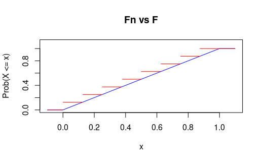

### Sean $\{X_n\}_{n = 1}^\infty$ variables aleatorias independientes tales que $\mathbb{P}(X_n = 0) = \mathbb{P}(X_n = 1) = \frac{1}{2}, \quad n = 1, 2, \dots$. Pruebe que la variable aleatoria $X = \sum_{n = 1}^\infty \frac{X_n}{2^n}$ tiene distribución uniforme.

Demostración:

Sea $S_k = \sum_{n = 1}^k \frac{X_n}{2^n}$. Es fácil ver **[(por inducción)](https://austriamax.github.io/austriamax.probaP.github.io/P15_6_1.html)** que $S_k$ toma valores en \[\{\frac{0}{2^k},\frac{1}{2^k},\frac{2}{2^k}, \frac{3}{2^k}, \dots, \frac{2^k-1}{2^k}\}.\]

Primero vamos a mostrar que la distribución de $S_k$ es una uniforme discreta y después que converge a una v.a. uniforme continua.

\[\begin{align*}
\mathbb{P}(S_k = s) &= \mathbb{P}(X_1 = s_1, X_2 = s_2, \dots, X_k = s_k) && (\mbox{Donde } s_i \mbox{ es la }i-\mbox{ésima componente de la representación binaria de }s)\\
&= \mathbb{P}(X_1 = s_1)\mathbb{P}(X_2 = s_2)\dots\mathbb{P}(X_k = s_k) &&(\mbox{Independencia})\\
&= \frac{1}{2^k} &&(\mbox{Por hipótesis } p = \frac{1}{2})
\end{align*}
\]

Como $\mathbb{P}(S_k = s) = \frac{1}{2^k}, \quad \forall s \in \{\frac{0}{2^k},\frac{1}{2^k},\frac{2}{2^k}, \frac{3}{2^k}, \dots, \frac{2^k-1}{2^k}\}$ podemos concluir que
\[S_k \sim Unif\{\frac{0}{2^k},\frac{1}{2^k},\frac{2}{2^k}, \frac{3}{2^k}, \dots, \frac{2^k-1}{2^k}\}\]

Así la función de distribución de $S_k$ es de la forma:

\[F_{S_k}(x) = 
     \begin{cases}
       0 &\quad\text{para } x<0\\
       \frac{\lfloor 2^kx + 1 \rfloor}{2^k} &\quad\text{para } 0\leq x \leq \frac{2^k-1}{2^k}\\
       1 &\quad\text{otro caso.} \\ 
     \end{cases}\]
     
Donde $\lfloor * \rfloor$ es la función piso. 

Ahora, la densidad de una $Unif(0,1)$ tiene la forma

\[F_U(x) = 
     \begin{cases}
       0 &\quad\text{para } x\leq0\\
       x &\quad\text{para } 0< x < 1\\
       1 &\quad\text{otro caso.} \\ 
     \end{cases} \]

Tomando $x \in (0,1)$ tenemos que 

\[
\begin{align*}
|F_{S_k}(x) - F_U(x)| &= |\frac{\lfloor 2^kx+1 \rfloor}{2^{k}} - x|\\\\
&= \frac{|\lfloor 2^kx + 1 \rfloor - 2^{k}x|}{2^{k}}\\
& =  \frac{\lfloor 2^kx + 1 \rfloor - 2^{k}x}{2^{k}}\\
&\leq  \frac{\lfloor 2^kx\rfloor + \lfloor1 \rfloor - 2^{k}x}{2^{k}}\\
&=\frac{\lfloor 2^kx\rfloor - 2^{k}x}{2^{k}}  +\frac{1}{2^{k}}\\\\
&<\frac{1}{2^{k}}
\end{align*}
\]

\[\therefore |F_{S_k}(x) - F_U(x)| \leq \frac{1}{2^{k}}, \quad \forall x\in \mathbb{R}\]

Es decir, $F_{S_k}$ converge uniformemente a $F_U$. Entonces se concluye que \[X \sim Unif(0,1).\]

