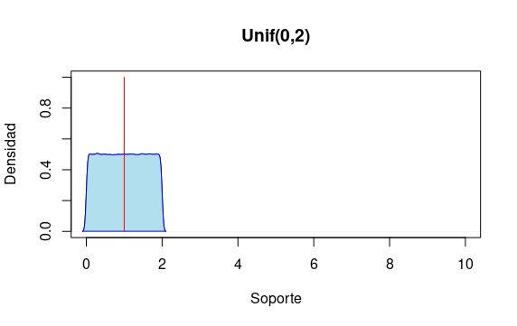
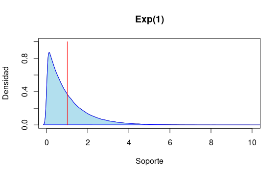

#Si $X,Y: \Omega \longmapsto \mathbb{R}^+$ son dos v.a.en $\mathscr{L}_1$ y $\mathbb{E}(X) = \mathbb{E}(Y)$ es cierto que $X(\omega) = Y(\omega)$ salvo en un conjunto de medida cero? 

Respuesta: La afirmación es falta, veamos un contraejemplo.

1. $X \sim U(0,2)$ tiene media 1.

2. $Y \sim exp(1)$ tiene media 1.

