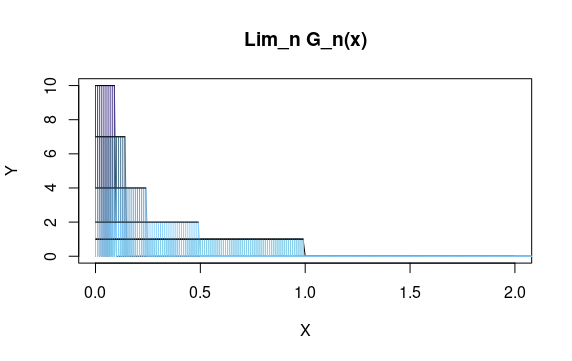

7.6. Dar un ejemplo de una sucesión de funciones $f_n:[a,b]\longmapsto \mathbb{R}$ con $n = 1, 2, \dots$ que sean Riemann integrables tales que $\lim_n f_n(x)$ existe para cada $x \in [a,b]$ pero no es Riemann integrable o bien no se cumple que $\int_a^b\lim_n f_n(x)dx = \lim_n \int_a^b f_n(x)dx$.

Contraejemplo:

Sea $G_n(x) = n 1_{(0,1/n)}(x)$. 

Así $\lim_{n \to \infty} G_n(x) = 0 \quad \forall x \in \mathbb{R}$.

Por lo que \[\int_{\mathbb{R}} \lim_{n \to \infty} G_n(x)dx = 0 \].

Por otro lado

\[\int_{\mathbb{R}} G_n(x)dx = n (\frac{1}{n}) = 1 \quad \forall n \in  \mathbb{N}\] 

Por lo que 

\[\lim_{n \to \infty}\int_{\mathbb{R}} G_n(x)dx = 1\]

\[\therefore \quad \lim_{n \to \infty}\int_{\mathbb{R}} G_n(x)dx \neq \int_{\mathbb{R}} \lim_{n \to \infty} G_n(x)dx\].

